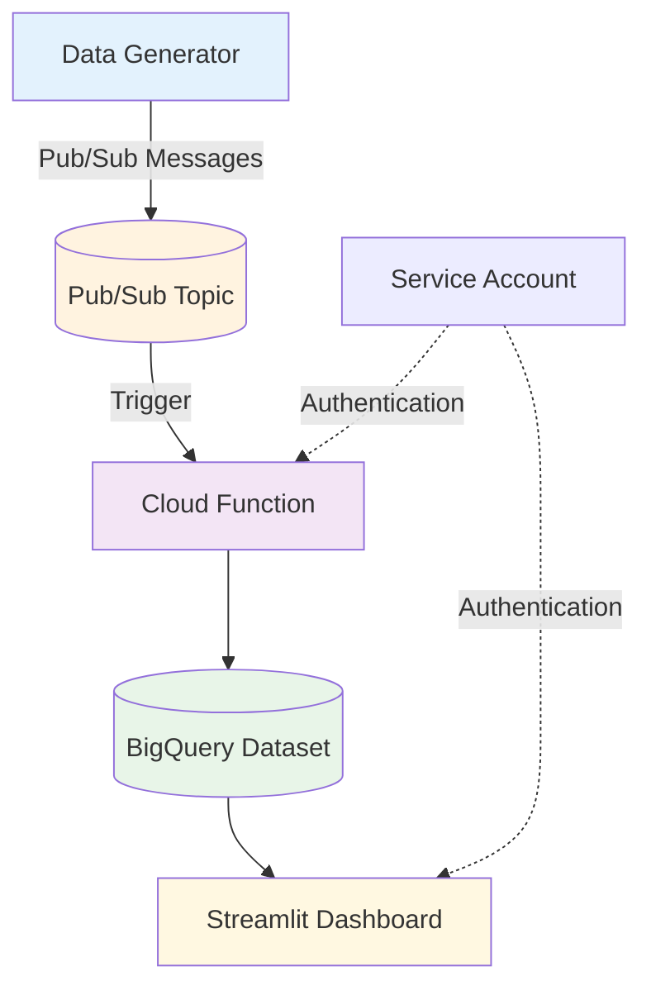

# IoT Sensor Data Pipeline


Production-ready data engineering project demonstrating modern cloud-native architecture and streaming data processing.

## Business Impact

**Problem**: Traditional agricultural monitoring relies on manual inspections, leading to late detection of crop stress, inefficient irrigation scheduling, and reactive farm management with higher operational costs.

**Solution**: Real-time IoT sensor monitoring with automated anomaly detection that enables:
- Proactive maintenance through early warning systems
- Reduced operational costs via remote monitoring
- Optimized resource usage through data-driven decisions
- Predictive analytics for future planning

## Architecture Overview



## Technical Stack

| Layer | Local Development | Cloud Production |
|-------|------------------|------------------|
| Data Generation | Python Script | Python Script |
| Message Streaming | Apache Kafka | Google Pub/Sub |
| Orchestration | Apache Airflow | Cloud Function |
| Data Warehouse | PostgreSQL | BigQuery |
| Transformations | dbt Core | Direct SQL |
| Analytics | Streamlit | Streamlit |
| Infrastructure | Docker Compose | Terraform |

## Architecture Decisions

**dbt Integration Strategy:**
- **Local Development**: Full dbt Core integration with Airflow orchestration
- **Cloud Production**: Direct BigQuery to Dashboard for demo efficiency  
- **Future Scaling**: dbt models ready for dbt Cloud or containerized deployment

**Why This Hybrid Approach:**
- Cost optimization: Avoids unnecessary dbt Cloud costs for demonstration
- Complexity management: Focuses on core streaming architecture  
- Production ready: Transformation logic exists and could be deployed instantly

## Key Features

- Real-time data processing with automatic anomaly detection
- Dimensional modeling with staging to marts architecture
- Infrastructure as Code using Terraform (13 Google Cloud resources)
- Cost optimization with partitioned tables and demo-friendly settings
- Environment-aware applications (local/cloud mode switching)
- Comprehensive data quality testing with dbt

## Getting Started

### Option 1: Cloud Production Deployment (Recommended)

Deploy to Google Cloud with minimal, demo-friendly architecture:

#### Standard Deployment (Manual Testing)
For development and testing:

```bash
# 1. Set up environment
python3 -m venv .venv
source .venv/bin/activate
export GCP_PROJECT_ID=your-project-id

# 2. Configure Terraform variables
cd terraform
cp terraform.tfvars.example terraform.tfvars
# Edit terraform.tfvars with your project_id  

cd ..

# 3. One-command deployment (includes function source creation)
./scripts/run-cloud.sh

# 4. Frontload BigQuery with 6 weeks of historical data (3 sensors)
DASHBOARD_MODE=cloud GCP_PROJECT_ID=your-project-id python3 scripts/frontload-cloud-data.py

# 5. Start applications with explicit mode
# Data generator
python3 src/generator/simulate_stream.py cloud --project-id your-project-id
# Dashboard (export variables since streamlit doesn't take arguments)
export DASHBOARD_MODE=cloud 
export GCP_PROJECT_ID=your-project-id 
streamlit run src/dashboard/app.py
```

#### Live Demo Deployment (Always-On Showcase)
For employer demonstrations and portfolio showcase:

```bash
# 1. Set up environment (same as above)
python3 -m venv .venv && source .venv/bin/activate
pip install -r src/requirements.txt

# 2. Configure GCP and deploy live demo
export GCP_PROJECT_ID=your-project-id
gcloud auth login
gcloud config set project $GCP_PROJECT_ID

# 3. Deploy always-on live demo
./scripts/deploy-live-demo.sh
```

**Live Demo Features**:
- Always-available dashboard URL for employers
- Automated data generation every hour via Cloud Scheduler
- Real-time charts, anomaly detection, and interactive analytics
- Professional, production-ready architecture

**Benefits**: Serverless, auto-scaling, monitoring, cost controls, CI/CD
**Cost**: 
- Standard: ~$5-10/month (manual testing)
- Live Demo: ~$10-15/month (always-on with hourly data generation)

### Option 2: Local Development

Run locally for development and testing:

```bash
# 1. Set up environment
python3 -m venv .venv
source .venv/bin/activate

# 2. One-command setup (includes 6 weeks of historical data!)
./scripts/run-local.sh

       # 3. Start applications
       python3 src/generator/simulate_stream.py local  # Data generator
       streamlit run src/dashboard/app.py             # Dashboard (defaults to local)

# 4. Enable Airflow pipeline (optional)
# Visit http://localhost:8080 (username: airflow, password: airflow) 
# and trigger the 'iot_pipeline' DAG manually
```

**Access Points**:
- Dashboard: http://localhost:8501
- Airflow: http://localhost:8080
- Kafka UI: http://localhost:8085

## Project Structure

```
├── src/                      # Unified source code (DRY principle)
│   ├── dashboard/           # Environment-aware Streamlit dashboard
│   ├── generator/           # Unified data generator (Kafka + Pub/Sub)
│   └── requirements.txt     # Consolidated dependencies
├── scripts/                  # Deployment automation
│   ├── run-local.sh         # Local development setup
│   └── run-cloud.sh         # Cloud deployment script
├── terraform/                # Infrastructure as Code (Google Cloud)
│   ├── main.tf              # Core resources (Pub/Sub, BigQuery, Cloud Function)
│   ├── variables.tf         # Input variables
│   ├── outputs.tf           # Output values
│   └── terraform.tfvars     # Configuration (copy from .example)
├── cloud/                    # Cloud-specific configurations
│   └── functions/           # Cloud Function source code
│       ├── main.py          # Pub/Sub to BigQuery processor
│       └── requirements.txt # Function dependencies
├── airflow/dags/            # Workflow orchestration (local development)
├── dbt/models/              # Data transformations (staging to marts)
├── sql/                     # Database schemas
└── diagrams/                # Architecture documentation
```

## Additional Resources

- [Cloud Deployment Guide](terraform/README.md): Complete Terraform documentation
- [Architecture Diagrams](diagrams/): Detailed technical diagrams
  - [Local vs Cloud Migration](diagrams/local-vs-cloud.mmd)
  - [Data Flow Details](diagrams/data-flow.mmd)  
  - [Infrastructure Components](diagrams/terraform-resources.mmd)

## Technical Highlights

**Architecture Decisions**:
- Streaming vs Batch: Real-time processing enables immediate anomaly detection
- Serverless-First: Cloud Functions and Cloud Run for cost efficiency and scalability
- Infrastructure as Code: Terraform for reproducible, version-controlled deployments
- DRY Principle: Single codebase with environment detection (local/cloud)

**Production Readiness**:
- Data Quality: Comprehensive dbt testing with range validations and referential integrity
- Observability: Custom metrics, alerting, and budget monitoring
- Security: IAM best practices, service accounts, and encrypted data storage
- Scalability: Partitioned tables, auto-scaling, and cost optimization

**DevOps Integration**:
- CI/CD Pipeline: Automated testing, building, and deployment
- Environment Management: Separate dev/staging/prod configurations  
- Monitoring: Health checks, performance metrics, and anomaly detection

## Cost Optimization

The system includes intelligent cost controls for cloud deployment:

**Smart Rate Limiting**:
- Local Mode: 10 sensors, 1-second intervals (unlimited for development)
- Cloud Mode: 3 sensors, 1-minute intervals (demo-friendly costs)

**Cost Breakdown** (Cloud Mode):
```
Monthly: ~129,600 messages
├── Pub/Sub: $5.18/month
├── Cloud Functions: $0.05/month  
├── BigQuery: $0.65/month
└── Total: ~$5.88/month
```

**Budget Protection**: Terraform includes budget alerts and spending limits to prevent unexpected charges.

## Cleanup

Use standard Terraform commands:
```bash
cd terraform
terraform destroy  # Remove all cloud resources
```

---

This project demonstrates enterprise-grade data engineering skills including streaming data processing, cloud architecture, Infrastructure as Code, and production monitoring - perfect for showcasing modern data platform capabilities.