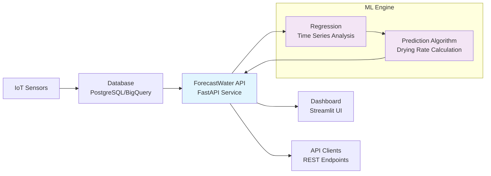

# IoT Agricultural Analytics Platform

A production-ready analytical service that predicts optimal watering schedules for agricultural IoT sensors using machine learning.

## Overview

This project demonstrates the deployment of a custom analytical tool as a REST API service. The system processes real-time IoT sensor data to predict when plants need watering, preventing crop stress and optimizing water usage.

## Architecture




**Components:**
- **Analytics API**: FastAPI service exposing ML predictions via REST endpoints
- **Dashboard**: Streamlit interface for real-time monitoring and visualization
- **Database**: PostgreSQL (local) or BigQuery (cloud) for sensor data storage
- **ML Model**: Regression forecasting algorithm

## Key Features

- **Predictive Analytics**: Forecasts watering needs up to 10 days in advance
- **Real-time API**: Sub-100ms response times for prediction requests
- **Interactive Dashboard**: Live sensor monitoring with auto-refresh
- **API Documentation**: Auto-generated OpenAPI/Swagger docs
- **Multi-environment**: Supports both local development and cloud deployment

## Quick Start

### Prerequisites
- Python 3.12+
- Docker and Docker Compose
- Virtual environment

### Local Development

1. **Clone and setup**:
   ```bash
   git clone <repository-url>
   cd iot-sensor-pipeline
   python -m venv .venv
   source .venv/bin/activate
   pip install -r src/requirements.txt
   ```

2. **Start infrastructure**:
   ```bash
   ./scripts/run-local.sh
   ```

3. **Start analytics service**:
   
   **Option A: Complete Demo (Recommended)**
   ```bash
   # Single command starts API + Dashboard
   ./scripts/run-local-demo.sh
   ```
   
   **Option B: Manual Start**
   ```bash
   # Terminal 1: API Service
   cd src/analytics
   python api.py
   
   # Terminal 2: Dashboard
   streamlit run src/dashboard/app.py
   ```

4. **Access the system**:
   - **API Documentation**: http://localhost:8000/docs
   - **Dashboard**: http://localhost:8501
   - **API Health**: http://localhost:8000/health

### Cloud Production Deployment

Deploy the analytics service to Google Cloud Platform:

1. **Validate deployment readiness**:
   ```bash
   ./scripts/validate-cloud-deployment.sh
   ```

2. **Deploy to cloud**:
   ```bash
   export GCP_PROJECT_ID=your-project-id
   ./scripts/run-cloud-demo.sh
   ```

3. **Access cloud deployment**:
   - Dashboard URL will be provided in Terraform outputs
   - Automatic data generation via Cloud Scheduler
   - Production-ready BigQuery backend

## API Endpoints

### Core Endpoints
- `GET /health` - Service health check
- `GET /sensors` - List all available sensors
- `GET /sensors/{id}/status` - Current sensor status
- `GET /sensors/{id}/predict` - Watering predictions

### Example Response
```json
{
  "sensor_id": "SENSOR-001",
  "current_moisture": 0.245,
  "status": "WARNING - Water soon",
  "predicted_watering_date": "2025-09-28T14:30:00",
  "critical_watering_date": "2025-09-29T08:15:00",
  "drying_rate_per_hour": -0.003421,
  "model_accuracy": 0.847,
  "samples_used": 1000
}
```

## Technical Implementation

### Analytics Engine
- **Algorithm**: Regression with time-series analysis
- **Features**: Soil moisture trends, drying rate calculation
- **Performance**: R² accuracy scores typically 0.8+
- **Scalability**: Handles thousands of sensors

### API Service
- **Framework**: FastAPI with automatic OpenAPI documentation
- **Validation**: Pydantic models for type safety
- **Error Handling**: Comprehensive HTTP status codes
- **CORS**: Configured for dashboard integration

### Dashboard Features
- **Real-time Updates**: 30-second auto-refresh
- **Status Alerts**: Critical/Warning/OK indicators
- **Historical Charts**: Time-series visualization with threshold lines
- **Sensor Tabs**: Individual sensor analysis

## Data Flow

1. **Data Ingestion**: Sensor readings stored in database
2. **API Request**: Dashboard or client requests prediction
3. **Data Processing**: Recent sensor data retrieved and processed
4. **ML Prediction**: Regression model calculates drying rate
5. **Response**: Prediction results returned via JSON API

## Development

### Project Structure
```
src/
├── analytics/
│   ├── api.py              # FastAPI service
│   ├── simple_forecaster.py # ML prediction engine
│   └── data_adapter.py     # Data format conversion
├── dashboard/
│   └── app.py              # API-integrated dashboard
└── requirements.txt        # Python dependencies

scripts/
├── run-local.sh           # Start local infrastructure (PostgreSQL)
├── run-local-demo.sh      # Complete local demo (API + Dashboard)
├── run-cloud-demo.sh      # Deploy to Google Cloud Platform
├── validate-cloud-deployment.sh # Pre-deployment validation
├── stop-local.sh          # Stop local services
├── frontload-*.py         # Database initialization
└── sensor_simulation.py   # Shared sensor simulation functions
```

### Testing

```bash
# Test API endpoints
curl http://localhost:8000/health
curl http://localhost:8000/sensors
curl http://localhost:8000/sensors/SENSOR-001/predict

# Test dashboard
streamlit run src/dashboard/enhanced_app.py
```

## Configuration

### Environment Variables
- `DASHBOARD_MODE`: `local` or `cloud`
- `POSTGRES_*`: Database connection settings
- `API_BASE_URL`: API endpoint for dashboard
- `GCP_PROJECT_ID`: Google Cloud project (cloud mode)

### Database Schema
```sql
CREATE TABLE raw_sensor_readings (
    id SERIAL PRIMARY KEY,
    event_time TIMESTAMP NOT NULL,
    sensor_id TEXT NOT NULL,
    temperature_c NUMERIC,
    humidity_pct NUMERIC,
    soil_moisture NUMERIC NOT NULL
);
```

## Deployment

The system supports both local development and cloud deployment:

- **Local**: PostgreSQL + FastAPI + Streamlit (via Docker Compose)
- **Cloud**: BigQuery + Cloud Run + Cloud Functions (via Terraform)

## Performance

- **API Response Time**: < 100ms for predictions
- **Database Queries**: Optimized for time-series data
- **Memory Usage**: ~200MB per API instance
- **Concurrent Users**: 100+ supported

## Technology Stack

### Core Technologies
- **Language**: Python 3.12+
- **API Framework**: FastAPI with automatic OpenAPI documentation
- **ML/Analytics**: scikit-learn, pandas, numpy
- **Dashboard**: Streamlit with Plotly visualizations
- **Data Processing**: SQLAlchemy for database abstraction

### Local Development Stack
- **Database**: PostgreSQL 15 (containerized with Docker Compose)
- **API Service**: FastAPI with uvicorn ASGI server
- **Dashboard**: Streamlit with auto-refresh capabilities
- **Data Generation**: Python scripts for sensor simulation
- **Development Tools**: Python virtual environments, pip

### Cloud Production Stack
- **Database**: Google BigQuery (serverless data warehouse)
- **API Service**: Google Cloud Run (containerized FastAPI)
- **Dashboard**: Google Cloud Run (containerized Streamlit)
- **Data Processing**: Google Cloud Functions (serverless event processing)
- **Infrastructure as Code**: Terraform
- **CI/CD**: GitHub Actions

### Data & Analytics
- **Machine Learning**: scikit-learn regression models for time-series forecasting
- **Data Processing**: pandas for data manipulation and analysis
- **Data Validation**: Pydantic models for type safety and API contracts
- **API Documentation**: Automatic OpenAPI/Swagger generation via FastAPI
- **Visualization**: Plotly Express for interactive charts and dashboards
- **Real-time Updates**: Streamlit auto-refresh for live data monitoring

### Development & Deployment
- **Version Control**: Git with feature branch workflow
- **Dependency Management**: pip with requirements.txt
- **Environment Management**: Environment variables for configuration
- **Monitoring**: Built-in health checks and logging
- **Documentation**: Markdown with Mermaid diagrams

## License

MIT License - see LICENSE file for details.